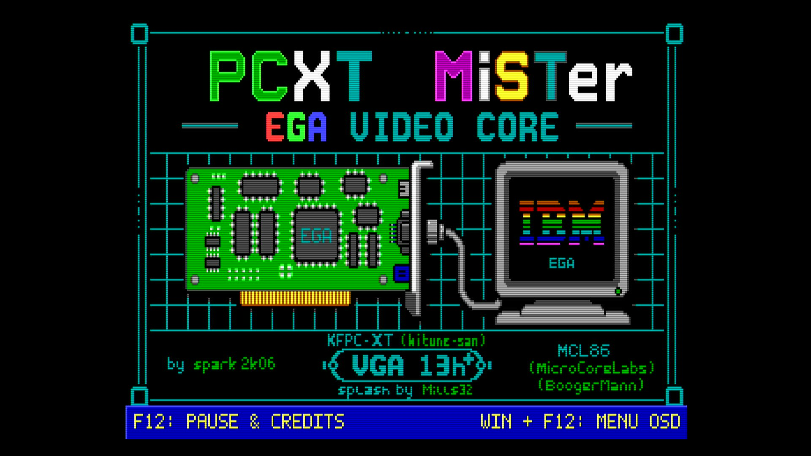

# [IBM PC/XT](https://en.wikipedia.org/wiki/IBM_Personal_Computer_XT) for [MiSTer FPGA](https://mister-devel.github.io/MkDocs_MiSTer/)

PCXT port for MiSTer by [@spark2k06](https://github.com/spark2k06/).

Discussion and development of the core take place in the
[MiSTerFPGA PCXT forum section](https://misterfpga.org/viewforum.php?f=40).

## Description

The goal of this core is to provide a reliable IBM PC/XT-compatible machine for
MiSTer. It builds on the [MCL86 core](https://github.com/MicroCoreLabs/Projects/tree/master/MCL86)
from [@MicroCoreLabs](https://github.com/MicroCoreLabs/) and
[KFPC-XT](https://github.com/kitune-san/KFPC-XT) from
[@kitune-san](https://github.com/kitune-san).

The video path is a full EGA implementation. Earlier releases used the
[Graphics Gremlin](https://github.com/schlae/graphics-gremlin) CGA and Hercules
adapters from TubeTimeUS ([@schlae](https://github.com/schlae)); those have been
replaced, and CGA-compatible software now runs through the EGA path the way it
does on real EGA hardware. The EGA and VGA mode 13h behaviour is modelled on the
video emulation in [86Box](https://github.com/86box/86box).

[JTOPL](https://github.com/jotego/jtopl) by Jose Tejada
([@jotego](https://github.com/jotego)) provides AdLib sound.

Splash artwork by [@mills32](https://github.com/mills32).

For an architectural overview and possible future improvements, see the
[PCXT technical report](https://aitorgomez.net/pcxt-ega/core-report)
(source in [docs/report/](docs/report/CORE_REPORT.html)).

## Key features

* Selectable 8088 or 8086 bus mode, applied safely with Reset & apply settings
* CPU speed settings: 4.77 MHz, 7.16 MHz, 9.54 MHz, and a PC/AT 3.5 MHz equivalent (maximum speed)
* IBM PC/XT 5160 and compatible systems
* **EGA video**: sequencer, graphics controller, attribute controller and a four-plane VRAM, around the UM6845R CRTC
* Dual EGA dot clock, 14.318181 MHz and 16.257 MHz, selected per mode as on real hardware
* CGA-compatible text and graphics behaviour, provided by the EGA rather than a separate adapter
* **Direct 15 kHz CRT output**, with the 350-line modes convertible to 480i or 240p from the OSD
* **Optional VGA mode 13h** (320×200×256) with a 256-entry DAC, off by default and switched from the OSD
* 640 KiB conventional memory plus an optional 48 KiB UMB at C400h-CFFFh
* EGA BIOS option ROM support (required — the card is initialised by its own ROM, as on real hardware)
* Optional EMS memory up to 2 MiB, with a fixed D000h-DFFFh page frame
* XTIDE support
* Audio: AdLib, C/MS and PC speaker
* Joystick support and serial mouse on COM1 (for example CTMOUSE 1.9, in `hdd/`)
* Second SD card support
* EGA graphical boot splash

## Memory map

The 8088 exposes a 1 MiB physical address space. The core divides it as shown
below; the ROM rows describe the normal configuration after their images have
been loaded.

| Address range | Size | Core assignment | DOS availability |
| --- | ---: | --- | --- |
| `00000h–9FFFFh` | 640 KiB | Conventional SDRAM | Conventional memory |
| `A0000h–AFFFFh` | 64 KiB | EGA aperture and VGA mode 13h framebuffer | Reserved for video |
| `B0000h–B7FFFh` | 32 KiB | Selectable EGA monochrome aperture | Reserved for video |
| `B8000h–BFFFFh` | 32 KiB | Selectable EGA colour/text aperture | Reserved for video |
| `C0000h–C3FFFh` | 16 KiB | EGA option ROM | Reserved for EGA BIOS |
| `C4000h–CFFFFh` | 48 KiB | Optional SDRAM-backed UMB | UMB when enabled in the OSD |
| `D0000h–D3FFFh` | 16 KiB | EMS page-frame bank 0 | EMS bank 0 when enabled and mapped; otherwise unmapped |
| `D4000h–D7FFFh` | 16 KiB | EMS page-frame bank 1 | EMS bank 1 when enabled and mapped; otherwise unmapped |
| `D8000h–DBFFFh` | 16 KiB | EMS page-frame bank 2 | EMS bank 2 when enabled and mapped; otherwise unmapped |
| `DC000h–DFFFFh` | 16 KiB | EMS page-frame bank 3 | EMS bank 3 when enabled and mapped; otherwise unmapped |
| `E0000h–EBFFFh` | 48 KiB | Directly decoded SDRAM | Not registered as UMB by the supplied DOS configuration |
| `EC0000h–EFFFFh` | 16 KiB | XTIDE option ROM | Reserved when an XTIDE ROM is loaded |
| `F0000h–FFFFFh` | 64 KiB | Main system BIOS | Reserved for system BIOS |

EGA's graphics-controller map can select `A0000h–BFFFFh`, `A0000h–AFFFFh`,
`B0000h–B7FFFh` or `B8000h–BFFFFh`; the entire A/B area is therefore reserved
for video regardless of the active EGA map. VGA mode 13h owns `A0000h–AFFFFh`
while active.

The *Hardware → UMB C400-CFFF* OSD option controls only the 48 KiB C400h UMB
block. The supplied `hdd/CONFIG.SYS` registers `C400h–CFFFh` with
`USE!UMBS.SYS` and keeps `D000h–DFFFh` exclusively for EMS. Although the core
also decodes SDRAM at E000h–EBFFh, it is intentionally left outside the DOS UMB
chain: the two candidates are separated by the EMS frame, and treating
`C400h–EC00h` as one contiguous UMB would collide with EMS.

The *Hardware → 2MB EMS D000-DFFF* OSD option gates the EMS page frame as a
whole. When it is disabled, `D0000h–DFFFFh` is unmapped; when enabled, each of
its four 16 KiB banks responds only after its corresponding EMS page register
has been mapped.

## Video

EGA is the active video hardware model, and it is what the machine reports to
software. Standalone CGA, Hercules and Tandy video are no longer selectable
paths: CGA-compatible programs work because the EGA implements the
CGA-compatible modes, which is how a real EGA card behaved.

The dot clock follows Miscellaneous Output bit 2, so 200-line CGA-compatible
modes run at 14.318181 MHz and the 350-line and MDA-compatible modes at
16.257 MHz, rather than one fixed rate for everything.

The *Hardware → Monitor* option models the four monitor switches on the IBM
EGA card. `IBM 5154/ECD` is the default full EGA configuration;
`IBM 5153/CGA` internally selects the card's 80-column CGA switch pattern and
makes the IBM EGA BIOS use its
200-line, 8×8 text tables; and `IBM 5151/MDA` selects the 720×350, 80×25
monochrome mode 7 configuration. The 5151 profile interprets the EGA connector's
Mono Video and Intensity pins as normal and bright white, so *Full Color* is
neutral and the separate *Display* option can tint it green, amber, or otherwise.
The same connector path supports EGA BIOS mode `0Fh`, 640×350 monochrome
graphics, in addition to mode 7 text.
Monitor changes remain pending until *Reset & apply settings*, as on the
physical card the switches were read during POST. The graphical boot splash
always uses the 5154/ECD colour profile; the selected monitor takes effect when
the BIOS starts after it.

### CRT output

The core drives a 15 kHz CRT directly, with no scaler in between. The
scandoubler is permanently off, so the 200-line EGA and CGA-compatible modes
reach the display undoubled at 15.7 kHz, the way the original hardware drove
one, and VGA mode 13h is retimed onto that same 200-line raster.

`forced_scandoubler=1` therefore does nothing here, in any mode. It is not
being ignored by mistake: doubling the 200-line modes would put them at about
31 kHz, which is exactly what a television cannot lock to, so the scandoubler
is disabled in the RTL rather than left to surprise anyone. See
[31 kHz monitors](#31-khz-monitors) for what to use instead.

*Audio & Video → CRT H offset* and *CRT V offset* centre the picture. One pair
of values covers every mode that reaches a television. HDMI is unaffected by
any of this.

The 350-line EGA modes and MDA scan at about 21.8 and 18.4 kHz, which no 15 kHz
set will lock to. *Audio & Video → 350-line CRT* converts them:

* `Native` — the raster the card programs, unconverted. Default, and what an
  enhanced display, a 5151 or the scaler wants.
* `480i 15 kHz` — a standard interlaced television frame. All 350 lines are
  shown, half of them in each field.
* `240p 15 kHz` — a progressive 262-line frame. Steady, with no interlace
  flicker, but 350 lines are fitted into 224 and the rest are dropped.

The conversion captures a whole frame into the board's DDR3 and rebuilds the
raster from it, publishing only complete frames so a mode change landing
mid-picture cannot put half of one frame and half of another on screen. Nothing
is fed back to the emulated hardware: the CRTC, the display enable and the
retrace bits software polls behave identically whichever setting is chosen.

The CRT offsets deliberately do not move the `Native` 350-line picture. Those
modes do not go to a television, and they sit where the card's own registers
put them.

### 31 kHz monitors

There is no native 31 kHz output. Every raster the core generates itself is a
15 kHz one — the 200-line modes, mode 13h, and both 350-line conversions above —
and the 350-line and MDA modes left on `Native` run at 18.4 to 21.8 kHz on the
16.257 MHz dot clock, below what a VGA monitor will accept. A multisync CRT or a
flat panel on the analogue port is served by the scaler, in `MiSTer.ini`:

* `vga_scaler=1` — routes the scaler to the analogue output. The core's own
  15 kHz rasters are not used in this configuration.
* `video_mode=6` — the stock 640×480 at 25.175 MHz, so 31.47 kHz. A built-in
  preset, so there is no modeline to work out.
* `vsync_adjust=2` — makes the output follow the core's real 59.917 Hz instead
  of a fixed 60 Hz. The scaler then stops repeating a frame about every twelve
  seconds, and most of its latency goes with it. This produces a non-standard
  refresh rate, which is why the option carries warnings generally: a CRT will
  accept it, a flat panel may not, so drop to `vsync_adjust=1` if the picture
  is rejected.

Leave *350-line CRT* on `Native` here. The 480i and 240p conversions exist to
reach a television and have nothing to offer a monitor that can already show
350 lines progressively.

### VGA mode 13h

The *Audio & Video → VGA Mode 13h* option adds a 256-colour packed framebuffer
at `A000h` and a 256-entry DAC on ports `3C7h`–`3C9h`. It is **off by default**,
and while it is off those ports do not decode at all — a real IBM EGA has no DAC,
its palette lives in the attribute controller, so with the option off the card
answers exactly as an EGA should.

With the option on, the DAC feeds **every** video mode, not only mode 13h. This
matters for software that detects a VGA, switches to a 16-colour mode for
gameplay and then sets its colours through the DAC: Titus the Fox and
Prehistorik 2 both do this, and without it they render in the stock EGA palette.
Entries the program never wrote fall back to the EGA palette, so nothing changes
for software that does not touch the DAC.

`SW/vga/vgatsr.com` is the BIOS-side companion. The EGA option ROM has no DAC
subfunctions — `INT 10h AH=10h` with `AL=10h/12h/15h/17h` are VGA additions and
an EGA BIOS drops them silently — so the TSR hooks `INT 10h` and serves them,
along with the queries a game uses to detect a VGA in the first place. It
refuses to install when the OSD option is off, since claiming "VGA present" on a
machine that will never render mode 13h just sends games down a path that leaves
the screen black.

#### Should it stay off for EGA-only sessions?

For everyday use, leaving it on doesn't break anything: the DAC only overrides
a palette entry that software has actually written, so an EGA game that never
touches `3C7h`–`3C9h` renders identically either way, and `VGATSR.COM` chains
every unrecognised `INT 10h` call straight through to the real BIOS.

But the option exists for a reason, and turning it off is the right call when
you want the machine to behave and be detected as a real EGA with no VGA trace
at all — this is why the ports are gated on the option in the first place
rather than left decoding permanently:

* **Port-level fingerprint.** With the option on, ports `3C7h`–`3C9h` answer as
  a DAC even if no software ever calls the BIOS for one — a real IBM EGA
  doesn't decode those ports at all, its palette lives in the attribute
  controller. Software that fingerprints hardware by probing I/O ports
  directly, rather than going through `INT 10h`, can see that and conclude a
  VGA is present. Turning the option off closes those ports so the card
  answers exactly as an EGA should, to a port probe as much as to a BIOS call.
* **BIOS-level fidelity.** With `VGATSR.COM` resident, `INT 10h AH=12h/BL=10h`
  ("Return EGA information") — a standard EGA call, not a VGA-only one — is
  answered by the TSR with a fixed value instead of being chained to your
  loaded EGA BIOS ROM. Not loading the TSR means every EGA BIOS call gets
  exactly what that ROM would answer, with nothing intercepted.

So: fine to leave on for normal play, but turn it off when you specifically
want authentic, untraceable EGA behaviour — testing against real hardware, for
example, or running EGA-only software with nothing else in the picture.

## Current configuration

* System/ROM set to PC/XT
* EGA video active at boot
* CGA-compatible text and graphics behaviour through EGA
* Optional VGA mode 13h, enabled only from the OSD
* OPL2 enabled for common DOS FM audio
* CMS enabled
* EMS enabled for expanded memory

## Quick Start

* Build the EGA BIOS with `SW/ROMs/EGA/make_ega_bios_rom.py` and copy the
  resulting `ega_bios.rom` to the SD card. **The core cannot show a usable
  picture without it** — see [EGA BIOS — required](#ega-bios--required).
* Copy the contents of `games/PCXT` to your MiSTer SD card and extract `hd_image.zip`. It contains a [FreeDOS](https://www.freedos.org/) image.
* Select the core from Computers/PCXT.
* Press Win + F12 on your keyboard.
  * Model: IBM PCXT.
  * CPU Speed: pick a speed.
  * System & BIOS → CPU Type: choose 8088 (compatible default) or 8086.
  * FDD & HDD → HDD Image: FreeDOS_HD.img
  * System & BIOS → PCXT BIOS: choose a compatible system BIOS, such as `bios-micro8088-xtide.rom` from `SW/8088_bios/binaries/`.
  * System & BIOS → EGA BIOS: `ega_bios.rom`. **Required.**
* Choose Reset & apply settings.

The 8086 mode uses a six-byte prefetch queue and transfers aligned SDRAM words
over its private 16-bit path. Odd words and the XT-class video and peripheral
buses remain split into byte cycles. The fixed 4.77/7.16/9.54 MHz settings keep
the existing 8088 microcode timing; maximum speed exposes the full bus benefit.

### The F12 keys

* **Win + F12** opens the OSD. F12 on its own is the machine's, not the
  framework's, exactly as the splash says: it pauses and shows the credits.
  Once the OSD is open, F12 or Esc closes it again.
* **F12 during the boot splash** does the same thing: the credits come up and
  the machine is held, except that here it was already held and what stops is
  the splash's own countdown. Press it again to return to the splash and let
  it run out. That is the moment to reach the OSD with Win + F12 and pick a
  disk image or a video mode before DOS starts. Setting **Boot Splash Screen**
  to *No* still dismisses it, so a held splash is never a dead end.

## Known limitations

None specific to CPU speed remain. Two issues that used to affect the
**PC/AT 3.5 MHz** (maximum speed) setting are fixed in the current RTL:

* The former intermittent memory fault: an accepted RAM write is now retained
  until it reaches SDRAM even when its short CPU-side `MEMW` pulse overlaps a
  refresh. The refresh-collision regression passes at addresses across
  conventional memory, and Supersoft `SLOW REFRESH` has been confirmed
  error-free on MiSTer hardware.
* The intermittent IBM 5160 BIOS `101` at that speed: the 8088 core now
  samples `INTR` at instruction boundaries instead of asynchronously
  mid-instruction, closing a hot-interrupt race in the POST's PIC/PIT check.
  Hardware testing confirms the POST now completes without `101` at maximum
  speed.

Video is not affected by either fix. I/O writes to the video ports cross into
the video clock domain as posted writes with a guaranteed pulse width, so they
are independent of how short the CPU's bus cycle gets, and display behaviour
is the same at all four speeds.

An older prebuilt RBF will not contain these source changes.

See [docs/known-issues.md](docs/known-issues.md) for what remains open, and
[docs/max-speed-stability.md](docs/max-speed-stability.md) for the analysis
behind how the fastest CPU speed setting is built — what makes it fragile,
which parts were fixed and how, and what is still outstanding.

## RTC/CMOS port

The previous CGA/Hercules-based core exposed its RTC/CMOS device at
`2C0h`-`2C1h`. The EGA core mirrors `3C0h`-`3CFh` at `2C0h`-`2CFh`, so an
index write there also lands on the attribute controller and blanks the
display until the next mode change. The RTC/CMOS is now decoded at
`340h`-`341h` instead. Tools that read it directly — `GET_RTC.EXE` and the
`x86_launcher` AppId handled by `LAUNCHER.EXE` — need to be pointed at the
new port.

## ROM Instructions

ROMs are loaded from the **System & BIOS** section of the OSD. It provides slots
for the main system BIOS, an optional XTIDE ROM at `EC00h`, and the EGA BIOS,
which is required — see [EGA BIOS — required](#ega-bios--required) below.
Once loaded, a ROM remains available on subsequent boots until it is replaced.
Original and copyrighted system ROMs can be prepared with the Python scripts in
`SW/ROMs/`:

* `SW/ROMs/make_rom_with_ibm5160.py`: creates `pcxt.rom` from the original IBM 5160 ROM. It requires an XTIDE BIOS at `EC00h` to use hard-disk images.
* `SW/ROMs/make_rom_with_jukost.py`: creates `pcxt.rom` from the Juko ST ROM with the XTIDE BIOS embedded at `F000h`.

The same OSD section accepts an XTIDE ROM of up to 16 KiB at `EC00h`; one is
included in this repository.

Other Open Source ROMs are available in the same folder:

* `pcxt_pcxt31.rom`: includes the XTIDE BIOS at `F000h`. ([source code](https://github.com/virtualxt/pcxtbios))
* `bios-micro8088-xtide.rom`: Micro8088 BIOS with XTIDE support, built from the [8088 BIOS source code](https://github.com/skiselev/8088_bios).
* `ide_xtl.rom`: XTIDE BIOS used by some scripts and upgradeable from its [upstream project](https://www.xtideuniversalbios.org/).

### EGA BIOS — required

An **EGA BIOS** option ROM is loaded from the same section, and the core needs
it to produce a picture. It is not optional, and it is not only for software
that checks the equipment word.

On a real machine the video card's own option ROM is what programs the CRTC,
the sequencer and the attribute controller during POST. Nothing else does it.
With no EGA BIOS loaded those registers are never initialised, and the picture
has nowhere to go.

The core no longer lets that happen. If either the PCXT BIOS or the EGA BIOS is
missing, it stops at the boot splash instead of starting the machine, and says
which one it wants — see [If the core stops at the splash](#if-the-core-stops-at-the-splash).

Loading it also makes the machine report EGA in the equipment word, so software
that trusts the equipment word instead of probing takes the EGA path.

The original IBM EGA card BIOS (part number 6277356) is copyrighted and not
included in this repository. `SW/ROMs/EGA/make_ega_bios_rom.py` builds it from
the raw dump published at
[minuszerodegrees.net](https://minuszerodegrees.net/rom/rom.htm) (IBM, EGA,
U44, 27128), producing `ega_bios.rom`. That dump is stored byte-reversed — the
ROM socket on the card is wired with inverted address lines, so the raw EPROM
read doesn't match the order the CPU sees — and the script reverses it back
before writing the file.

### If the core stops at the splash

The splash staying on screen with a notice over it means a required ROM has not
been selected. The notice names which one, and repeats until it is:

* `No PCXT BIOS selected` — **System & BIOS → PCXT BIOS**
* `No EGA BIOS selected` — **System & BIOS → EGA BIOS**

The machine is held in reset for as long as that is true, and the splash is put
back up for it even if **Boot Splash Screen** is set to *No*. Both are
deliberate. An 8088 released with nothing at `F000h` executes whatever the
memory happens to hold and eventually reprograms the CRTC, at which point a
15 kHz television loses lock and takes the OSD with it — the "splash, then black
screen" that made the core impossible to configure without an HDMI display.
Holding it keeps the picture on the power-on 640×200, which any set that could
show the splash can show, so the OSD stays readable and the missing file can be
picked from the television itself.

Selecting the file releases the machine immediately; no reset is needed. The
same hold applies if a BIOS is replaced while the machine is running, which
restarts it rather than pulling `F000h` out from under DOS.

## Other BIOSes

* https://github.com/640-KB/GLaBIOS

## Mounting the FDD image

The floppy disk image size must be compatible with the BIOS, for example:

* On IBM 5160 only 360 KiB images work well.
* On Micro8088 only 720 KiB and 1.44 MiB images work properly.
* Other BIOS may not be compatible, such as OpenXT by Ja'akov Miles and Jon Petroski.

It is possible to use images smaller than the size supported by the BIOS, but
only pre-formatted images, as it will not be possible to format them from MS-DOS.

## Repository layout

* `rtl/video/` — the EGA core, the VGA mode 13h blocks and their testbenches
* `rtl/KFPC-XT/` — chipset, peripherals, RAM and the SDRAM controller
* `SW/vga/` — `vgatsr.asm` and the assembled `vgatsr.com`
* `SW/ROMs/` — scripts for preparing system ROMs
* `SW/8088_bios/` — Micro8088 BIOS sources and binaries
* `docs/` — open issues, and the root-cause analysis of the fastest CPU speed setting
* `docs/report/` — source for the [technical report](https://aitorgomez.net/pcxt-ega/core-report)

## Developers

Please send contributions and pull requests to the prerelease branch. They are
reviewed periodically and merged into the main branch as part of releases.

Thank you!
